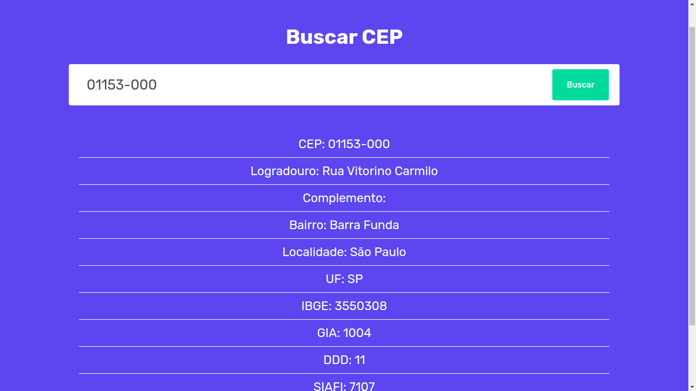
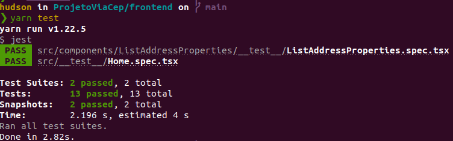
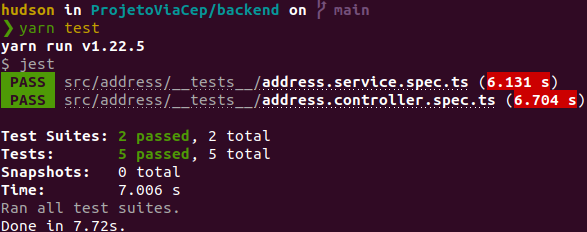

<br/>
<br/>

# ProjetoViaCep

<br/>
<br/>


<p>

</p>

<br/>
<br/>

Tabela de conteúdos
=================
<!--ts-->
   * [Como usar](#como-usar)
      * [Docker Compose](#docker-compose)
      * [Kubernetes](#kubernetes)
   * [Tests](#testes)
      * [Testar o Frontend](#testar-o-frontend)
      * [Testar o Backend](#testar-o-backend)
   * [Tecnologias](#tecnologias)
<!--te-->

<br/>

## Como Usar

<br/>

### Docker Compose

Antes de começar, você vai precisar ter instalado em sua máquina as seguintes ferramentas: [Docker](https://www.docker.com/), [Docker Compose](https://docs.docker.com/compose/).


```bash
# Clone o repositório do projeto 
$ git clone https://github.com/hudsonfranca/ProjetoViaCep.git

# Acesse a pasta do projeto no terminal/cmd
$ cd ProjetoViaCep

# Execute a aplicação
$ docker-compose up  

# A aplicação inciará na porta:3000 - acesse <http://localhost:3000>

# Se você quiser acessar a documentação da API acesse < http://localhost:4000/api/ > no seu navegador.

# encerrar a aplicação
$ docker-compose down 
```

<br/>
<br/>

### Kubernetes


Este guia se concentra na implantação do ProjetoViaCep em um cluster Kubernetes em execução no [Minikube](https://github.com/kubernetes/minikube#requirements).

Antes de começar, você vai precisar ter instalado em sua máquina as seguintes ferramentas: [Docker](https://www.docker.com/), [Helm](https://helm.sh/), [Minikube](https://github.com/kubernetes/minikube#requirements), [kubectl](https://kubernetes.io/docs/tasks/tools/).

```bash
# Inicie seu cluster
$ minikube start

# Habilite o Ingress controller no Minikube
$ minikube addons enable ingress

# Adicione o repositório Bitnami ao Helm com o seguinte comando
$ helm repo add bitnami https://charts.bitnami.com/bitnami

# Clone o repositório do projeto
$ git clone https://github.com/hudsonfranca/ProjetoViaCep.git

# Acesse a pasta do projeto no terminal/cmd
$ cd ProjetoViaCep

# Acesse a pasta charts no terminal/cmd
$ cd K8S/charts

# instale o chart do projeto
$ helm install projeto-viacep projeto-viacep

# Para acessar a aplicação você precisará pegar o IP do minikube, execute o seguinte comando
$ minikube ip

# Por exemplo se o IP do minikube for 192.168.49.2, você terá que acessar a url < http://192.168.49.2/ > no navegador.
# Se você quiser acessar a documentação da API acesse < http://192.168.49.2/api/ > no navegador.

# Se você quiser mudar algum parametro como o número de replicas do
# backend, edite o arquivo values.yaml que está na pasta K8S/charts/projeto-viacep/values.yaml . 

# Desinstalar o chart do projeto
$ helm uninstall projeto-viacep

```

<br/>
<br/>

## Testes
<br/>
<br/>

### Testar o Frontend

```bash
# Acesse a pasta do projeto no terminal/cmd
$ cd ProjetoViaCep

# Acesse a pasta frontend no terminal/cmd
$ cd frontend

# instale as dependências
$ yarn install

# Execute o comando
$ yarn test

```
<p>

</p>

<br/>
<br/>

### Testar o Backend

```bash
# Acesse a pasta do projeto no terminal/cmd
$ cd ProjetoViaCep

# Acesse a pasta backend no terminal/cmd
$ cd backend

# instale as dependências
$ yarn install

# Execute o comando
$ yarn test

```
<p>

</p>

<br/>
<br/>

## Tecnologias

As seguintes ferramentas foram usadas na construção do projeto:

- [Typescript](https://www.typescriptlang.org/)
- [Next.js](https://nextjs.org/)
- [Nestjs](https://nestjs.com/)
- [Nodejs](https://nodejs.org/en/)
- [Docker](https://www.docker.com/)
- [Docker Compose](https://docs.docker.com/compose/install/)
- [Postgresql](https://www.postgresql.org/)
- [Yarn](https://yarnpkg.com/)
- [styled-components](https://styled-components.com/)
- [Helm](https://helm.sh/)
- [Kubernetes](https://kubernetes.io/pt-br/)
- [Jest](https://jestjs.io/pt-BR/)
- [React Testing Library](https://testing-library.com/docs/react-testing-library/intro/)


